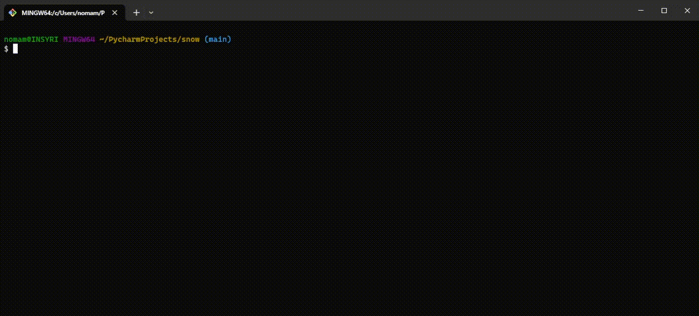

# ☃ [the] Cozy Computer
The Cozy Computer project, made with the Computer Science Club for the winter of 2023-24.

Upon the supervision of the president, the members of the club collaboratively engineer a computer program that displays
animated snow in a terminal, build a physical computer, and decorate a desk with festive ornaments to display in the 800
building when complete.

The primary objective of this project is to highlight the advantage of understanding problems intuitively by
breaking down complex concepts into simpler, more comprehensible components, allowing assessment to be more feasible and
ensuring an intuition of the project to draw better connections, faster. Effectively communicating these concepts in a
clear manner, devoid of  excessive technical language, serves as evidence of comprehending the program's structure while
also fostering more productive teamwork.

This direction of this project was partially inspired by the YouTube video "A tale of two problem solvers" by Grant
Sanderson (3Blue1Brown) and the approach that Sanderson took to understanding the nature of complex problems within his
other videos.

https://www.youtube.com/watch?v=ltLUadnCyi0

> This project was led by Noah Mercedes.

## How to Contribute
Contributing to open-source software is more than just code, improving the phrasing in documentation or updating old
information on project files is one way that helps the project without requiring any modifications to code.

Laid out problems with comprehensive introductions will be accessible through the [issues](https://gitlab.com/insyri/snow/-/issues)
interface on GitLab, you are able to claim, comment, suggest, or question the nature of the issue before and during the
assessment of these problems or planned work. You can also look within files for comments containing `TODO` to look for
things to contribute to; please open an issue and claim to fix it before doing it though, so we know that its being
assessed by someone.

1. Create a GitLab account.
2. [Fork](https://docs.gitlab.com/ee/user/project/repository/forking_workflow.html) and clone the repository.
3. Do your magic!
4. Commit, finalize, and submit a [merge request](https://docs.gitlab.com/ee/user/project/merge_requests/)
on the main repository [here](https://gitlab.com/insyri/snow/-/merge_requests).
5. (If applicable) Come back to the issue and mention the merge request.

Be more than welcome to ask questions about using GitLab, Git, or the project in general if you are lost!

## Project Status

| Does It Work? | Fancy?        | SUPER FANCY?? | Almost Ready To Ship | Complete! |
|---------------|---------------|---------------|----------------------|-----------|
| YES!!         | Getting there |               |                      |           |

